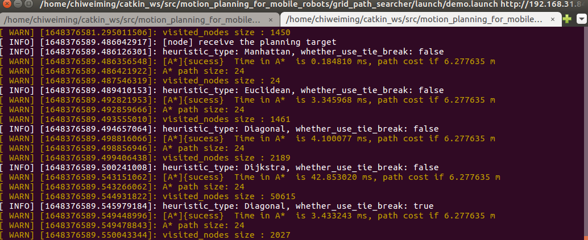

# SearchBased motion planning

## 第二章作业

作业链接：https://github.com/roschiweiming/mobile-robot-motion-planning

### 算法流程及运行效果

A星 算法

```bash
# A*算法流程
# 维持一个最优队列(priority queue)取存储被扩展的节点,代码中采用C++ STL的multimap实现，multimap将{key,value}当做元素，允许重复元素。multimap根据key的排序准则⾃动将元素排序，因此使⽤时只需考虑插⼊和删除操作即可。
# 定义一个启发式函数，代码见getHeu()函数
# 将起点放入最优队列中
# 指定起点的ｇ值为０，其余节点的ｇ值为infinite
# 进入循环
	# 如果队列为空，return false； break；
	# 从最优队列中移除f(n) = g(n) + h(n)最小的节点，该节点作为当前节点，并标志为已扩展
	# 如果当前节点是终点，则 return true; break;
	# 对于当前节点周围未被扩展的邻居节点：
		# 如果 g(m) = infinite
			# 设置 g(m) = g(n) + Cnm;
			# 把当前节点加入最优队列
		# 如果 g(m) > g(n) + Cnm
			# 更新 g(m) = g(n) + Cnm;
	# end
# 结束循环
```

Rviz可视化，路径点颜色为黑色


### 不同启发式函数对A星运行效率的影响

```c++
// 在AstarPathFinder中设置heuristic_type_和use_Tie_breaker_变量，分别表示采用的启发式函数以及是否使用Tie breaker
// 在程序中我们同时对比不同启发式函数及其是否使用tie breaker ，终端显示如下
在demo_node.cpp中实例化如下对象：
    AstarPathFinder * _astar_path_finder     = new AstarPathFinder();// 使用Manhattan作为启发式函数,无Tie breaker
    AstarPathFinder * _astar_path_finder_with_Euclidean = new AstarPathFinder(Euclidean, false); //使用Euclidean作为启发式函数,无Tie breaker
    AstarPathFinder * _astar_path_finder_with_Diagonal = new AstarPathFinder(Diagonal, false); // 使用Diagonal作为启发式函数,无Tie breaker
    AstarPathFinder * _astar_path_finder_with_Dijkstra = new AstarPathFinder(Dijkstra, false); // 使用Diagonal作为启发式函数,无Tie breaker
    AstarPathFinder * _astar_path_finder_with_Euclidean_TB = new AstarPathFinder(Euclidean, true); //使用Euclidean作为启发式函数,启动tie breaker
```



下表为不同启发式函数对A星算法的影响，本实验在同一张地图上随机选取了5个目标点进行路径搜索。从表可知，在此类三维栅格地图中，Diagonal启发式函数效果最好。


### Tie Breaker 对A星算法的影响

下表为是否使用tie breaker对A星算法的影响，本实验在同一张地图上随机选取了5个目标点进行路径搜索。从表中可以看出，使用tie breaker后，visited size减少，搜索效率有一定的提升。


### A星 and JPS

​		通常情况下，JPS要比A*工作的更好，尤其是在复杂环境下可以显著的减少遍历点的数目，但是在开阔的环境下，由于JPS的跳跃方式，会浪费大量资源在搜索无效的方向。


### Reference


