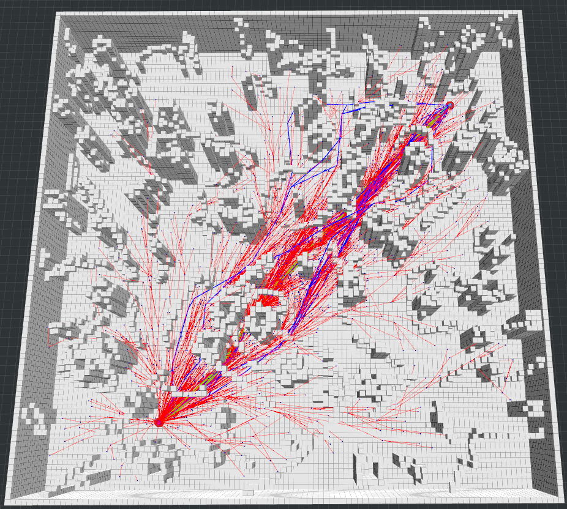

# Sampling-based Path Finding

## 第三章作业

作业链接：https://github.com/roschiweiming/mobile-robot-motion-planning

### RRT

### RRT*

#### 程序

##### ChooseParent()

##### rewire()

### Informed-RRT

### RRT* VS RRT VS Informed-RRT

RRT* 是概率完备和渐进最优的，相比于RRT，引入了ChooseParent()让new_node去选择更优的父节点，引入rewire()让new_node周围的节点也判断new_node是否是更优的父节点。从上述两个运行图我们可以很清晰的发现，RRT*的搜索路径更加直，说明所调整的节点代价更低。因此，RRT *  通常搜索的路径长度更低

但是，从图中我们可以发现，RRT算法是对自由空间进行均匀采样，搜索树上会生成很多冗余的分支，所以RRT算法的收敛速度较慢，Informed-RRT算法就是对RRT的采样过程进行优化得到的算法，它**采用一个椭圆采样方式来代替全局均匀采样**，可以加快收敛速度

### Reference

[1]https://github.com/ZJU-FAST-Lab/sampling-based-path-finding

[2] [路径规划 | 随机采样算法：Informed-RRT*](https://zhuanlan.zhihu.com/p/372315811)

