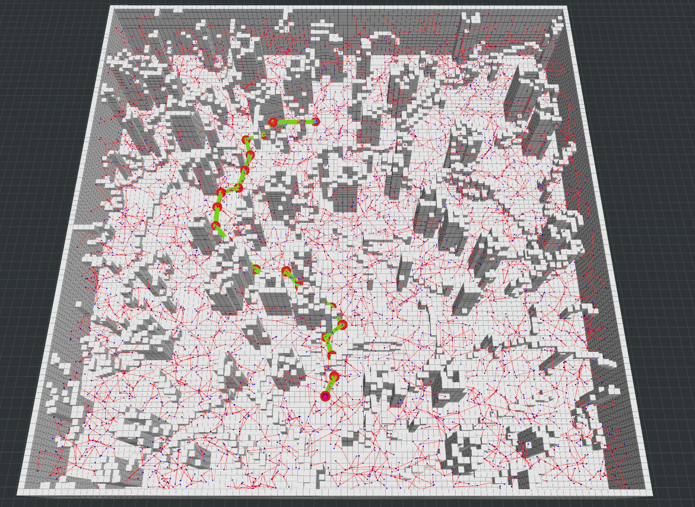
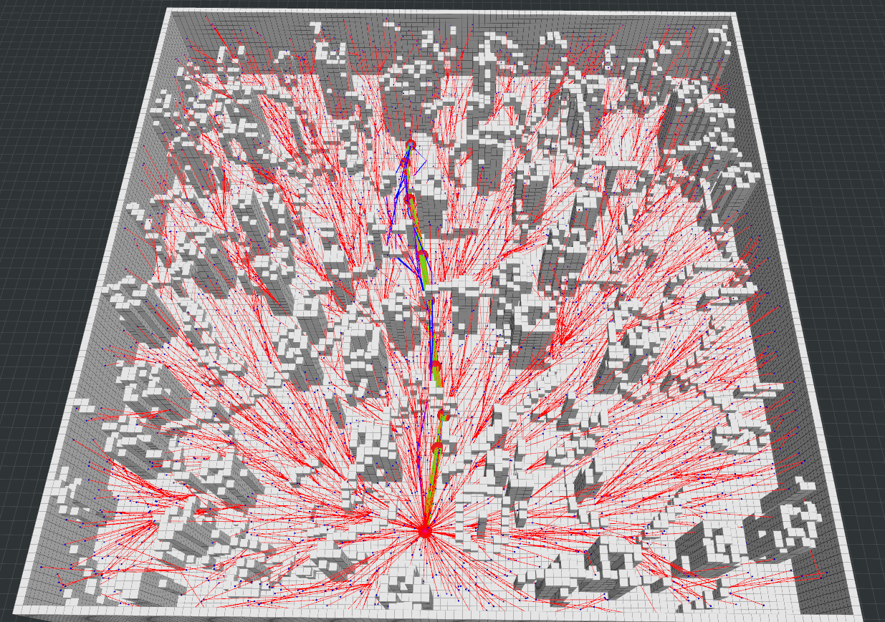
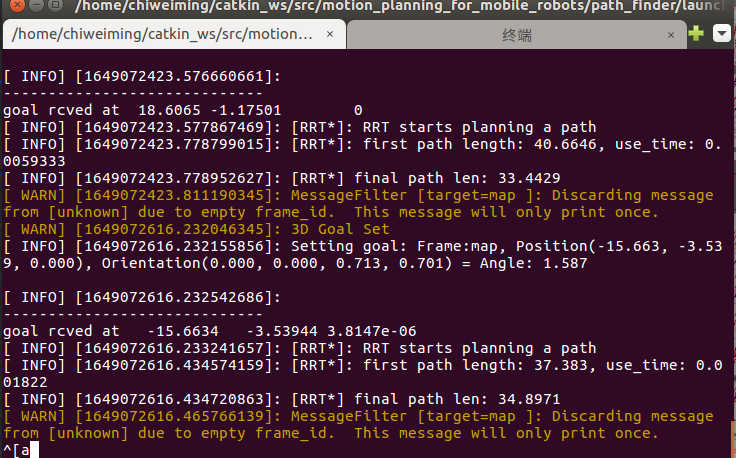
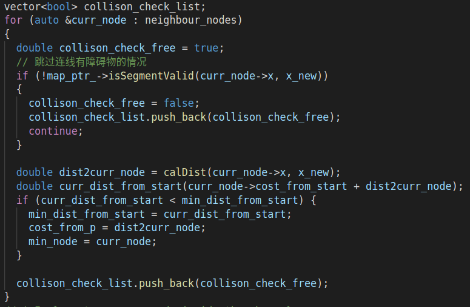
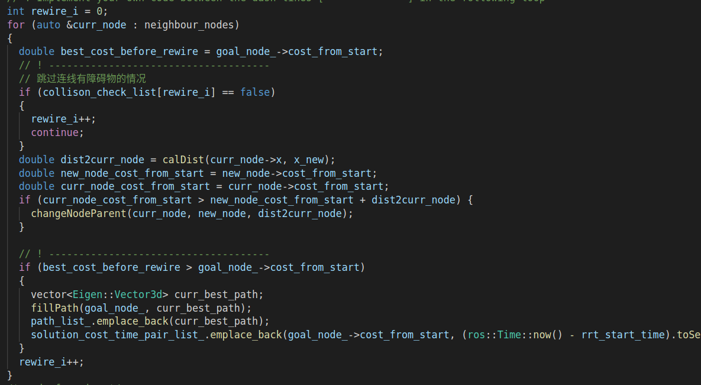

# Sampling-based Path Finding

## 第三章作业

作业链接：https://github.com/roschiweiming/mobile-robot-motion-planning

### RRT

### RRT*

### 程序

#### ChooseParent()

#### rewire()

### RRT* VS RRT

RRT* 是概率完备和渐进最优的，相比于RRT，引入了ChooseParent()让new_node去选择更优的父节点，引入rewire()让new_node周围的节点也判断new_node是否是更优的父节点。从上述两个运行图我们可以很清晰的发现，RRT*的搜索路径更加直，说明所调整的节点代价更低。因此，RRT *  通常搜索的路径长度更低

