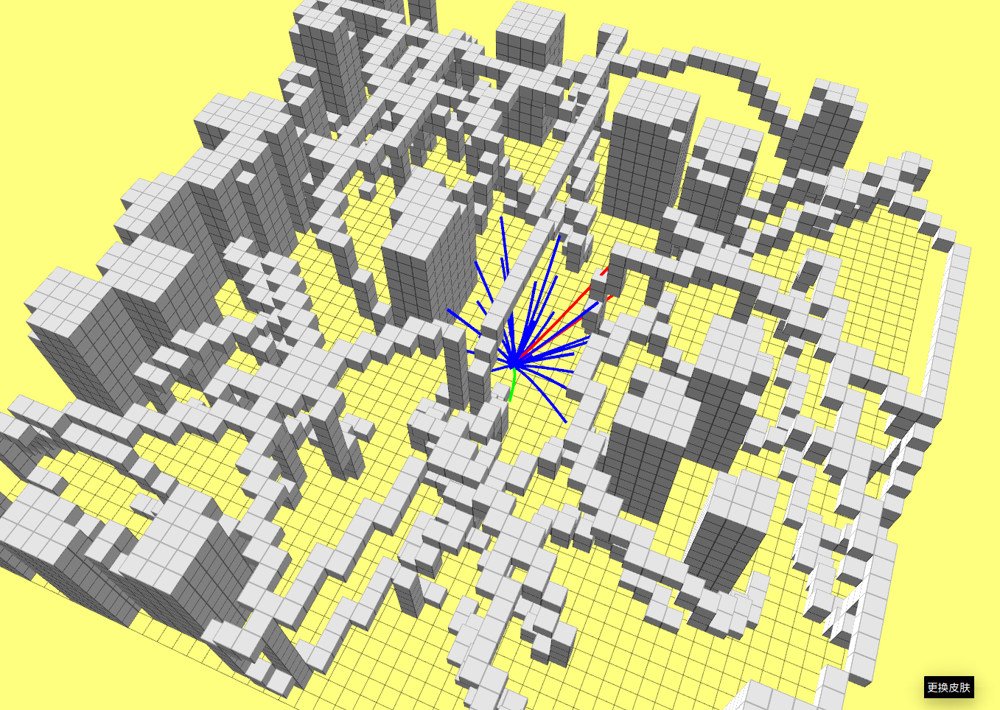

# kinodynamic Path Finding

作业链接：https://github.com/roschiweiming/mobile-robot-motion-planning

### Requirements

- For the OBVP problem stated in slides p.25-p.29, please get the optimal solution (control, state, and time) for partially free final state case.
- Suppose the position is fixed, velocity and acceleration are free here.
- Build an ego-graph of the linear modeled robot.
- Select the best trajectory closest to the planning target.

### Solution

代码测试结果：

### Reference

